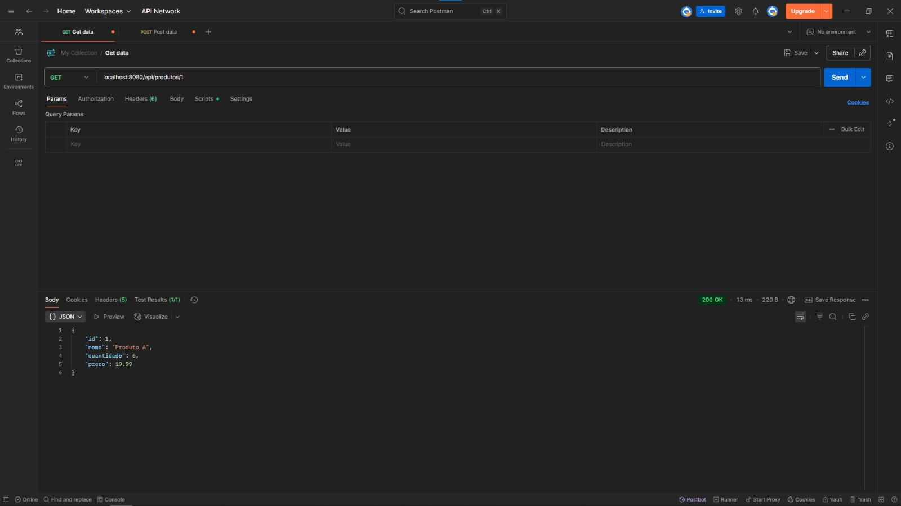
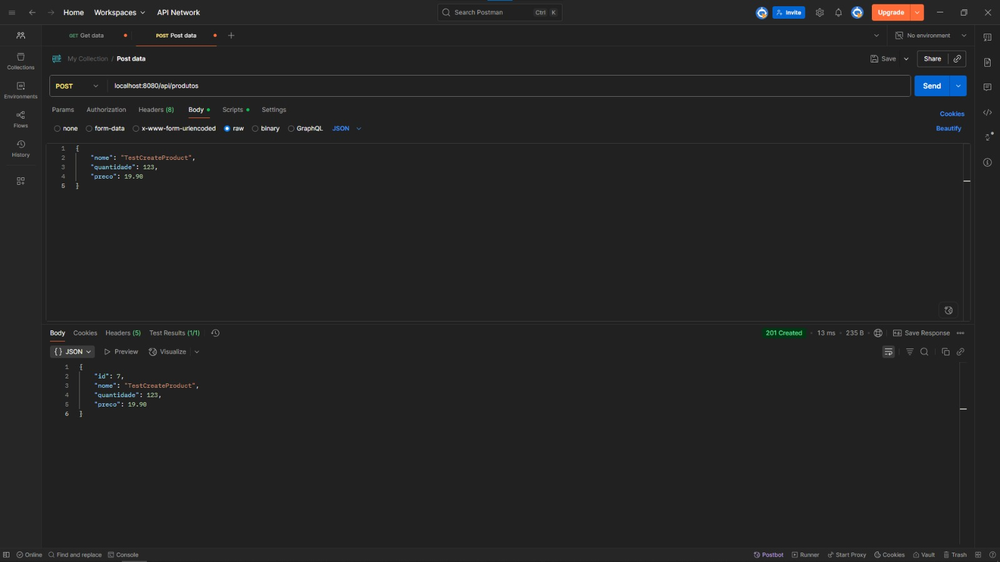
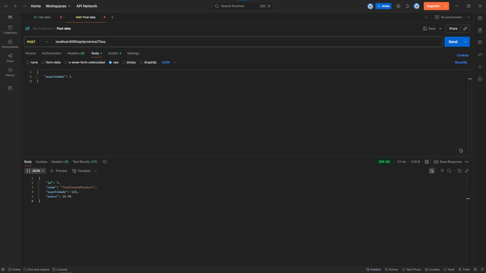

[README em Português](README.md)

# Stock API

REST API for product inventory management.

## Technologies

- Java 21
- Spring Boot
- Spring Data JPA
- PostgreSQL
- Jakarta Validation

## Features

- Create products with name, quantity, and price
- List all products
- Get product by ID
- Buy products (updates stock quantity with validation)
- Restock a product

## How to run

### Prerequisites

- Java 21
- Maven
- PostgreSQL

### Running with Maven

#### Comando
```bash
./mvnw spring-boot:run
```
The application will be available at: `http://localhost:8080/api/produtos`

#### Using PostgreSQL
1. Create the database:
```sql
CREATE DATABASE estoque_db;
```

2. Configure the `application.properties` file:
```properties
spring.datasource.url=jdbc:postgresql://localhost:5432/estoque-api
spring.datasource.username=your_user
spring.datasource.password=your_password
spring.jpa.hibernate.ddl-auto=validate
spring.flyway.enabled=true
spring.flyway.locations=classpath:db/migration
spring.flyway.baseline-on-migrate=true
```

3. Run the project:
```bash
./mvnw spring-boot:run
```

## Endpoints

| Method | Endpoint                     | Description                        |
|--------|------------------------------|------------------------------------|
| GET    | `/api/produtos`              | List all products                  |
| GET    | `/api/produtos/{id}`         | Get product by ID                  |
| POST   | `/api/produtos`              | Create a new product               |
| POST   | `/api/produtos/{id}/buy`     | Buy product (decrease stock)       |
| POST   | `/api/produtos/{id}/restock` | Restock a product                  |

## Request examples

### Create Product

- POST /api/produtos
- Content-Type: application/json

```http
{
  "nome": "Pen",
  "quantidade": 100,
  "preco": 2.50
}
```

### Buy Product

- POST /api/produtos/1/buy
- Content-Type: application/json
```http
{
  "quantidade": 5
}
```
### Restock Product

- POST /api/produtos/1/restock
- Content-Type: application/json
```json
{
  "quantidade": 50
}
```

## Images







## Error handling

- If the product is not found, returns HTTP 404.
- If the purchase quantity is greater than the stock, returns an error with the message "Insufficient stock".
- Automatic validation for required fields and minimum values.

## How to contribute

- Fork this repository
- Create a branch for your feature or fix (`git checkout -b feature/new-feature`)
- Commit your changes with clear messages
- Submit a pull request

## License

This project is licensed under the MIT license. See the [LICENSE](LICENSE) file for
