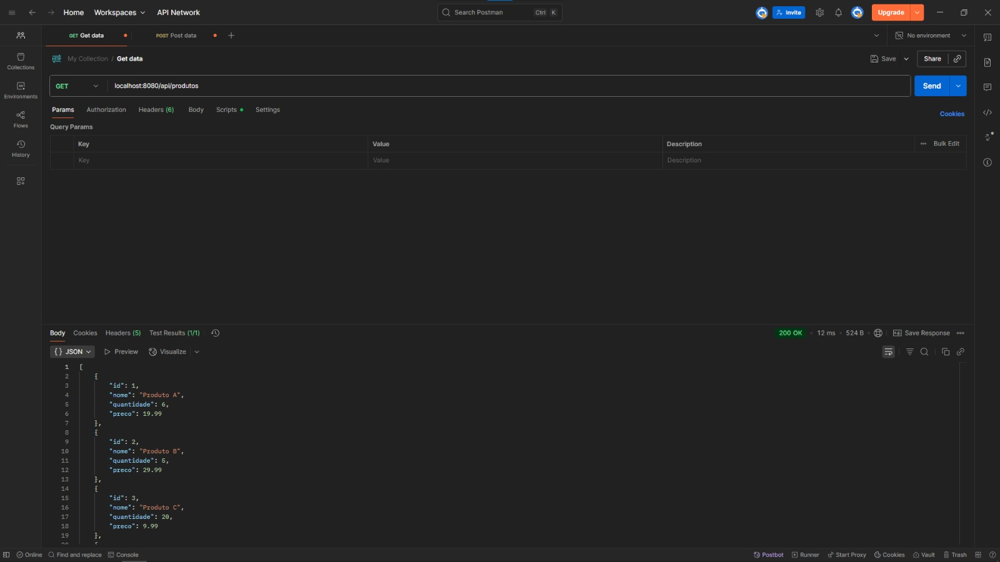
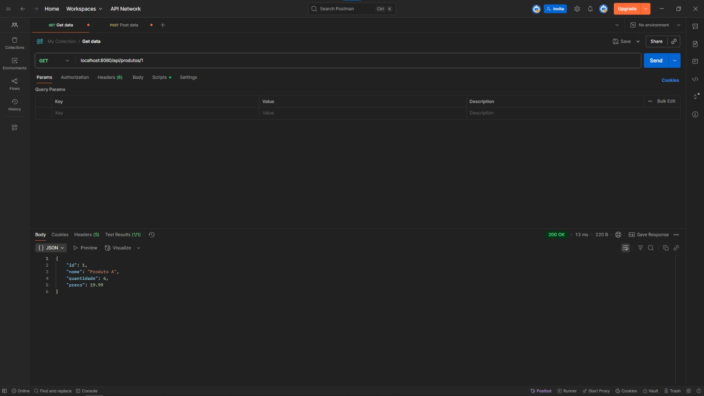
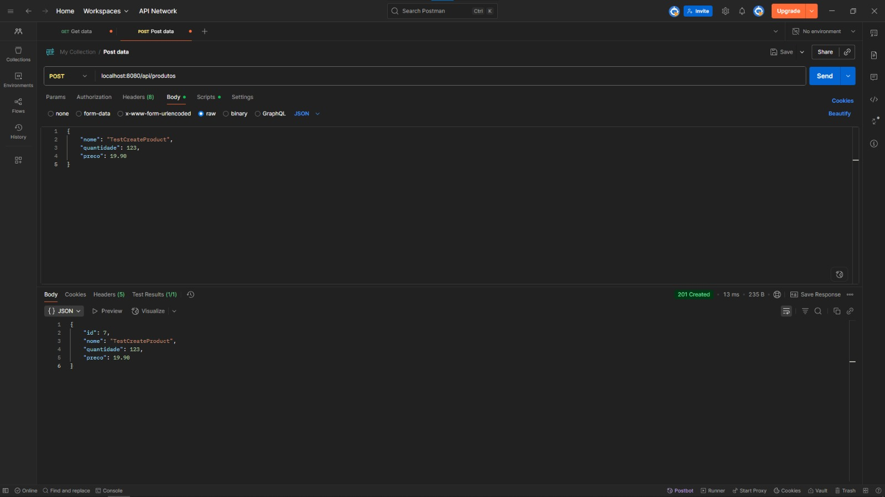
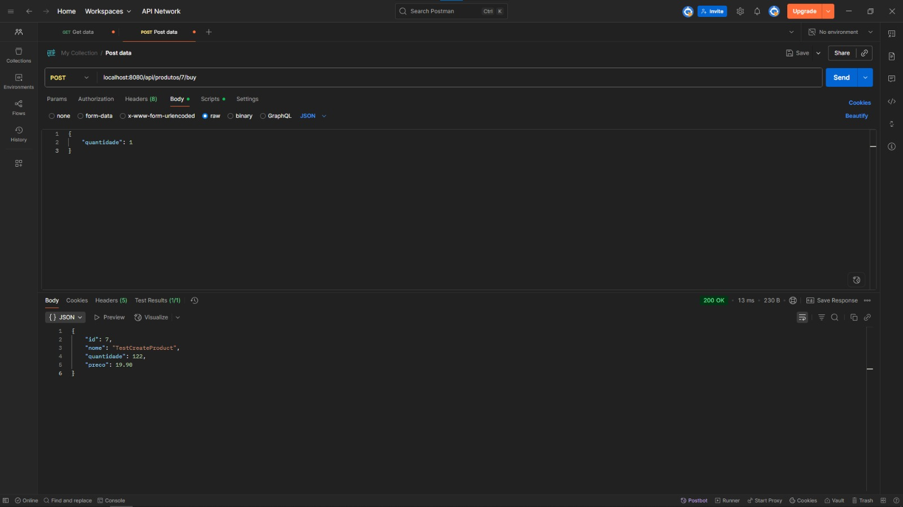
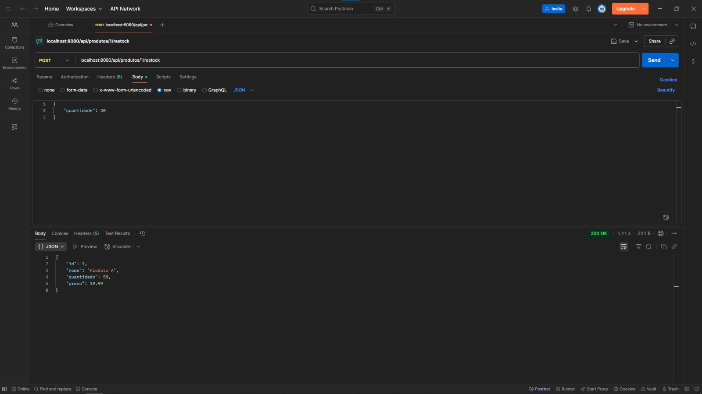

[README in English](README-en.md)

# Estoque API

API REST para gerenciamento de estoque de produtos.

## Tecnologias

- Java 21
- Spring Boot
- Spring Data JPA
- PostgreSQL
- Jakarta Validation

## Funcionalidades

- Criar produtos com nome, quantidade e preço
- Listar todos os produtos
- Consultar produto por ID
- Comprar produtos (atualiza a quantidade em estoque com validação)
- Repor estoque de um produto

## Como rodar

### Pré-requisitos

- Java 21
- Maven
- PostgreSQL

### Rodando com Maven

#### Usando H2 (ambiente de teste)
```bash
./mvnw spring-boot:run
```
A aplicação estará disponível em: `http://localhost:8080/api/produtos`

#### Usando PostgreSQL
1. Crie o banco:
```sql
CREATE DATABASE estoque_db;
```

2. Configure o arquivo `application.properties`:
```properties
spring.datasource.url=jdbc:postgresql://localhost:5432/estoque-api
spring.datasource.username=seu_usuario
spring.datasource.password=sua_senha
spring.jpa.hibernate.ddl-auto=validate
spring.flyway.enabled=true
spring.flyway.locations=classpath:db/migration
spring.flyway.baseline-on-migrate=true
```

3. Rode o projeto:
```bash
./mvnw spring-boot:run
```

## Endpoints

| Método | Endpoint                     | Descrição                          |
|--------|------------------------------|------------------------------------|
| GET    | `/api/produtos`              | Listar todos os produtos           |
| GET    | `/api/produtos/{id}`         | Buscar produto por ID              |
| POST   | `/api/produtos`              | Criar um novo produto              |
| POST   | `/api/produtos/{id}/buy`     | Comprar produto (diminuir estoque) |
| POST   | `/api/produtos/{id}/restock` | Repor estoque de um produto        |

## Exemplos de requisição

### Criar Produto

- POST /api/produtos
- Content-Type: application/json

```http
{
  "nome": "Caneta",
  "quantidade": 100,
  "preco": 2.50
}
```

### Comprar Produto

- POST /api/produtos/1/buy
- Content-Type: application/json
```http
{
  "quantidade": 5
}
```
### Repor Estoque

- POST /api/produtos/1/restock
- Content-Type: application/json
```json
{
  "quantidade": 50
}
```

## Imagens







## Tratamento de erros

- Se o produto não for encontrado, retorna HTTP 404.
- Se a quantidade para compra for maior que o estoque, retorna erro com mensagem "Estoque insuficiente".
- Validações automáticas para campos obrigatórios e valores mínimos.

## Como contribuir

- Faça um fork deste repositório
- Crie uma branch para sua feature ou correção (`git checkout -b feature/nova-funcionalidade`)
- Faça commit das mudanças com mensagens claras
- Envie um pull request

## Licença

Este projeto está licenciado sob a licença MIT. Veja o arquivo [LICENSE](LICENSE) para detalhes.
